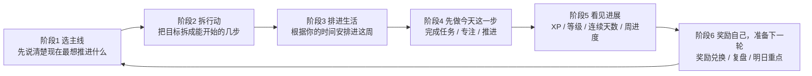
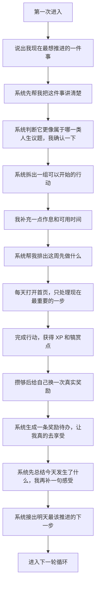
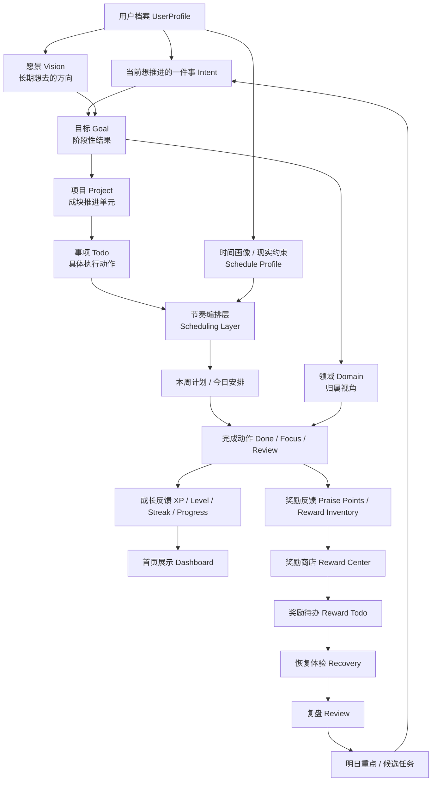
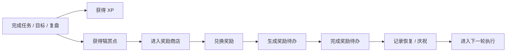
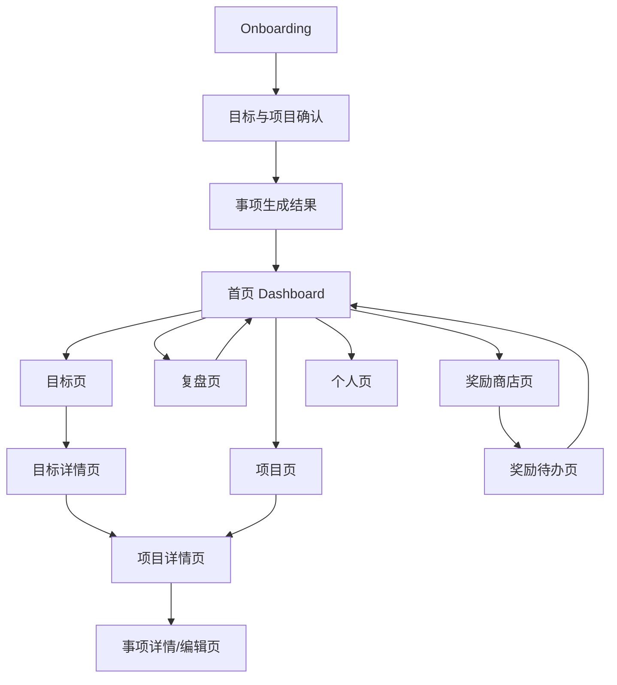
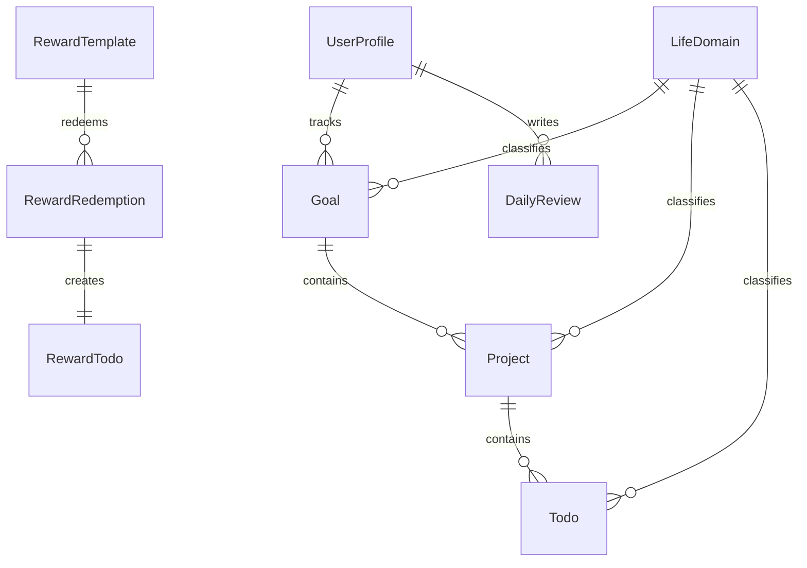
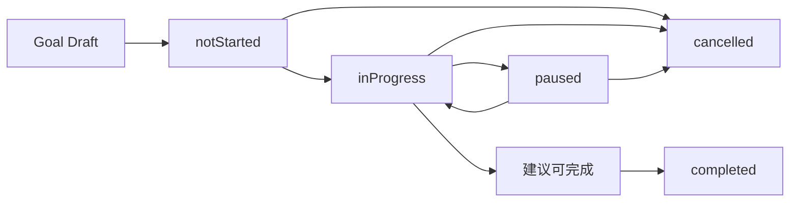
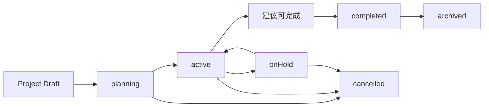
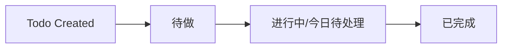

# Praxis 产品蓝图 V1

> 用于后续产品讨论、闭环设计和功能收敛的工作底稿

**版本：** V1  
**日期：** 2026-05-06  
**用途：** 统一用户旅程、阶段设计、核心闭环、功能逻辑图

---

## 1. 文档目标

这份文档不描述“代码里所有页面”，而是回答四个问题：

1. Praxis 这款产品要帮助用户完成什么转变
2. 用户从第一次进入到长期留存，会经历哪些阶段
3. 每个阶段的核心反馈、核心动作、核心风险是什么
4. 产品功能应该如何围绕闭环组织，而不是围绕页面堆叠

---

## 2. 产品一句话定义

### 面向团队的定义

Praxis 是一个把“我知道自己该改变，但总是推不动”这件事，变成“今天就能往前走一步，而且能持续走下去”的产品。

它不是单纯的 Todo 工具，也不是只提供计划的 AI 助手，而是一个围绕以下循环运转的系统：

`明确当前想推进的事 -> 生成目标与任务骨架 -> 根据现实时间做节奏编排 -> 推进执行 -> 获得反馈 -> 兑换奖励 -> 完成恢复 -> 复盘并进入下一轮`

### 面向普通用户的一句话

你只需要先告诉它：**你现在最想把哪件事拉回正轨。**

剩下的事情，Praxis 会帮你一步步做：

- 把这件事讲清楚
- 拆成今天能做的小动作
- 按你的生活节奏安排进去
- 做完以后给你看见进展
- 让你有理由奖励自己，然后继续下一轮

### 对外不要先讲的词

下面这些词适合内部讨论，不适合作为用户第一次接触时的主表达：

- 人生经营
- 任务骨架
- 节奏编排
- 双反馈系统
- 重点领域

普通用户更容易理解的说法应该是：

- 我现在最想推进什么
- 先做哪一步
- 这周怎么安排
- 我今天推进了多少
- 我这次给自己换什么奖励

---

## 3. 当前产品现状

基于当前代码，Praxis 已经具备以下主线能力：

- Onboarding：选择重点领域、输入本周目标、设置每周可投入时间
- Dashboard：首页聚合今日任务、等级、重点领域、AI 建议、复盘入口
- Domains：展示五大人生领域，并允许设置当前重点领域
- Domain Workspace：围绕单个领域组织目标、项目、任务
- Goals：围绕“当前重点目标”和“进行中的目标”组织执行
- AI Plan：把一句目标输入拆成 Goal + Project + Todos
- XP：完成任务/目标/复盘获得 XP，提升等级和连续活跃天数

但当前闭环还不完整，主要问题是：

- 等级和 XP 只代表“精神奖励”，没有“兑现奖励”
- 执行后只有成长感，没有恢复感
- 缺少“完成努力后应该如何奖励自己”的产品机制
- 缺少围绕奖励系统的长期驱动力设计
- 首次进入仍然偏“系统先问结构”，还不够偏“用户先说自己想推进什么”
- 复盘还没有形成“系统汇总事实 -> 用户补充判断 -> 产出下一步”的闭环
- “做什么”和“什么时候做”还没有被拆成两层能力

### 3.1 当前术语约定

为了避免后续讨论里概念混用，当前蓝图统一采用下面这组命名：

- `XP`：代表行动积累和推进记录
- `等级`：代表长期执行力和稳定性
- `犒赏点`：代表可以兑换真实奖励的可消费额度

三者分工如下：

- `XP` 和 `等级` 负责表达成长
- `犒赏点` 负责表达兑现
- 奖励中心、奖励兑换、奖励待办统一挂在 `犒赏点` 这条线上

---

## 4. 目标闭环定义

Praxis 的目标闭环建议定义为 6 个阶段。

为了兼顾产品设计和用户理解，建议保留两套命名：

| 内部阶段名 | 面向用户的说法 |
|-----------|---------------|
| 定向 | 选主线 |
| 规划 | 拆行动 |
| 编排 | 排进生活 |
| 执行 | 先做今天这一步 |
| 反馈 | 看见进展 |
| 奖励与复盘 | 奖励自己，准备下一轮 |

普通用户真正能记住的，不会是“定向-规划-编排”，而会是：

1. 先选现在最重要的一件事
2. 把它拆成几步
3. 塞进这周的生活里
4. 今天先做一步
5. 看见自己真的在往前走
6. 奖励一下自己，然后继续

完整循环如下：



这 6 个阶段不是页面，而是产品心智模型。

### 4.1 用户能直接听懂的版本

如果只用一段话对用户解释这个产品，建议用下面这类表达：

> 你不用一上来就把人生想明白。你只要先告诉我，你现在最想拉起来的是哪件事。  
> 我会帮你把它拆成几步，安排进这周，提醒你今天先做哪一步。  
> 你每完成一点，都会看到进展，也会慢慢攒出可以兑换的奖励。  
> 到一天结束时，系统会帮你总结今天发生了什么，并顺手接出明天的下一步。

---

## 5. 用户旅程图

### 5.1 整体用户旅程



### 5.2 分阶段旅程表

| 阶段 | 用户状态 | 用户目标 | 产品任务 | 当前已有能力 | 建议增强 |
|------|---------|---------|---------|-------------|---------|
| 阶段1 选主线 | 我脑子很乱，但我知道最近有件事一直压着我 | 先抓住现在最重要的一件事 | 先抓目标，再缩窄焦点 | Onboarding、领域选择 | 把首进入口从“先选领域”改为“先说最近最想拉起来什么” |
| 阶段2 拆行动 | 我知道自己想变好，但不知道第一步从哪下手 | 把愿望变成几步能开始的行动 | 生成目标、推断领域、生成任务骨架 | AI Plan、Goal、Project、Todo | 增加“目标草稿 -> 领域确认 -> 行动清单草稿”的顺序 |
| 阶段3 排进生活 | 我不是不想做，是不知道怎么塞进真实生活 | 把事情安排进我这周真的有空的地方 | 根据时间画像生成本周节奏 | 当前缺失 | 增加“任务生成层”和“节奏编排层”分离 |
| 阶段4 先做今天这一步 | 我容易拖延，也容易一下子把目标想太大 | 今天只做最重要的一步 | 首页今日任务、领域工作台 | Dashboard、Goal、Domain Detail | 增加执行阻力提示、恢复节奏建议 |
| 阶段5 看见进展 | 我需要确认自己不是三分钟热度 | 看见自己真的有在往前走 | XP、等级、连续天数、周进度 | XP Service、Profile、Dashboard | 增加领域等级、阶段徽章 |
| 阶段6 奖励自己，准备下一轮 | 我不只想被打分，我还想得到兑现和修正 | 奖励自己，并把明天顺出来 | 犒赏点、奖励商店、系统复盘、明日重点 | 当前部分缺失 | 奖励系统和复盘产出下一步一起闭环 |

---

## 6. 完整产品功能逻辑图

### 6.1 核心对象层级

Praxis 的产品结构里，`项目 Project` 不应该只是 Goal 下面附带出现的一个元素，而应该是明确的一层。

建议把核心对象关系定义为：

`愿景 Vision -> 目标 Goal -> 项目 Project -> 事项 Todo`

其中：

- `愿景 Vision`：回答“我这一阶段想把人生带到哪里”，偏长期方向，不直接进入日常执行
- `目标 Goal`：回答“我想在一段时间内达成什么结果”，可分长中短期
- `项目 Project`：回答“为了达成这个目标，我要推进哪几个成块的事情”
- `事项 Todo`：回答“我今天/这周具体要做什么”

`领域 Domain` 不应和这条主链路并列竞争，而应作为这些对象的**归属维度和观察视角**：

- 愿景可以跨领域
- 目标通常有主领域
- 项目可以服务一个或多个目标
- 事项通常挂在某个项目下，必要时也可直接挂目标

也就是说，结构上更合理的理解是：

`领域 = 我在看哪一块人生`

`愿景 / 目标 / 项目 / 事项 = 我到底要怎么往前推进`

### 6.2 顶层逻辑



### 6.3 一个具体例子

以你刚才举的例子，结构应该长这样：

```text
愿景：
提升收入安全感，逐步把月收入拉到 5w

目标：
3 个月内找到一份月入 2w 的主职工作
6 个月内跑通一个稳定带来月入 1w 的副业模型
12 个月内把总月收入提升到 5w

项目：
项目 A：找工作项目
项目 B：简历和作品集升级项目
项目 C：副业方向验证项目
项目 D：副业获客与转化项目

事项：
更新简历第一版
整理 3 个可展示的项目案例
本周投递 10 个岗位
约 2 位朋友帮忙内推
测试 1 个副业选题 landing page
```

这个例子说明一件事：

- `目标` 规定你要去哪里
- `项目` 规定你到底要推进哪几块
- `事项` 才是每天真正被执行的东西

如果没有 `项目` 这一层，`目标` 会直接压到 `事项` 上，用户会很容易觉得跨度太大，或者任务变得杂乱无组织。

### 6.4 功能分层

#### 第一层：聚焦层

回答“我现在到底该先经营哪一块人生”。

- Onboarding
- 当前意图输入
- 重点领域推断与确认
- 领域优先级切换
- 每周可投入时长

#### 第二层：规划层

回答“这个目标怎么拆成能执行的东西”。

- 愿景输入 / 愿景草稿
- Goal 草稿生成
- Goal 创建
- 领域归属确认
- AI Goal Planning
- Project 生成
- Todo 骨架生成
- 里程碑与关键结果

#### 第三层：编排层

回答“这些任务应该如何安排进这个用户的现实生活”。

- 时间画像采集
- 身份类型识别（学生 / 上班 / 时间自由）
- 工作日 / 周末可投入时长
- 偏好执行时间段
- 固定不可用时间
- 本周计划编排
- 今日任务建议
- 任务拆小 / 压缩 / 延后

#### 第四层：执行层

回答“今天最该做什么，以及我怎么推进”。

- Dashboard 今日任务
- Domain Workspace
- Goal 页重点目标
- Project 页当前项目
- Todo 列表
- Focus Session

#### 执行层 MVP 呈现建议

首页建议围绕三层信息组织：

1. `当前主目标`：让我知道这一阶段到底在奔什么结果
2. `当前推进项目`：让我知道最近具体在推进哪块大事
3. `今日事项`：让我知道今天先做哪一步

也就是说，首页不应只展示零散 Todo，也不应只展示抽象目标，而应该把：

`方向感（目标） + 推进块（项目） + 立即动作（事项）`

同时放在一个视图里。

#### 进度展示要求（MVP 已确认）

MVP 阶段，`项目 Project` 和 `目标 Goal` 都必须有明确的进度展示。

原因：

- 用户需要持续看到“这块推进到哪里了”
- 项目和目标的完成不应只在最终完成时才被感知
- 进度展示也是用户判断是否继续推进、调整节奏、或确认完成的重要依据

建议理解为：

- `Goal` 展示阶段性结果进度
- `Project` 展示该推进块的执行进度

#### 进度计算方式（MVP 已确认）

- `Project` 进度：根据该项目下所有事项的完成情况计算
- `Goal` 进度：根据该目标下所有项目中的所有事项完成情况计算

这意味着在 MVP 阶段：

- 项目进度首先是事项完成进度的映射
- 目标进度首先是项目集合内事项完成进度的汇总映射
- 先不引入更复杂的 phase 权重、关键路径权重或人工调权

#### 第五层：反馈层

回答“我有没有真的在前进”。

- XP
- 等级
- 连续活跃
- 本周进度
- 最近 XP 事件

#### 第六层：奖励层

回答“我努力之后，可以如何兑现给自己”。

- 犒赏点
- 奖励商店
- 奖励库存/奖励记录
- 奖励兑换
- 奖励待办

#### 第七层：复盘层

回答“这套系统是否在帮助我，以及下一轮该怎么调整”。

- 系统事实摘要
- AI 复盘草稿
- 用户判断补充
- 明日重点生成
- 候选任务生成
- 每周节奏总结
- 重点领域调整
- 奖励效果回顾

#### 复盘层 MVP 输出建议

MVP 阶段，复盘默认只输出 3 类结果：

1. 今天发生了什么
2. 明天最重要的一步
3. 是否需要调整当前项目节奏

复盘页结构建议采用：

`系统事实摘要 + AI 复盘草稿 + 用户补充判断`

MVP 暂不默认支持：

- 复盘后批量生成新事项
- 复盘后自动重排多个项目
- 复盘后直接生成完整周计划

### 6.5 主结构规则

为了避免后续产品继续在“领域、目标、项目、任务”之间打架，建议明确下面几条规则：

1. `愿景` 不是每天执行的对象，它是长期牵引
2. `目标` 是阶段性结果，是产品里的核心成果单位
3. `项目` 是目标和事项之间的桥梁，是主执行容器
4. `事项` 必须挂在项目下，不直接挂目标
5. `领域` 是分类维度，不是执行链路里的主容器

这意味着在用户心智里，最自然的表达应该是：

- 我想去哪里：愿景
- 我这一阶段要达成什么：目标
- 我最近正在推进哪几件大事：项目
- 我今天具体做什么：事项

---

## 7. 首次进入最小流程

首次进入不应要求用户填写完整档案，而应只采集最小必要信息。

### 推荐首次输入字段

1. 当前最想推进的一件事
2. 这周大概可投入的时间
3. 系统推断的领域确认

注意：这里不要求用户立即提供完整作息信息。首次输入只够生成目标和任务骨架，不负责精细排程。

### 当前建议

- `愿景 Vision` 保留在产品结构里，但**不进入 MVP 首次进入流程**
- 首次进入仍然从“当前想推进的一件事”开始
- 愿景相关输入放到后续档案补全、阶段升级或复盘后引导中
- MVP 先验证“把一件事推进起来”的闭环，不先要求用户定义长期人生方向

### 不建议首次强填的字段

- mission
- vision
- values
- 长期人生规划
- 完整奖励偏好

### 设计原则

- 用户第一次进入时，动机是“推进一件事”，不是“建立人生档案”
- 档案分为系统档案和身份档案
- 系统档案首次自动创建
- 身份档案在后续逐步补全

### 档案分层

#### 系统档案

用于产品运行的最低必要字段：

- focusedDomainId
- weeklyCapacityHours
- totalXp
- level
- streakDays
- lastActiveDate

#### 轻量时间画像

用于第二阶段节奏编排的最小必要字段：

- identityType（学生 / 上班 / 时间自由 / 其他）
- weekdayAvailableHours
- weekendAvailableHours
- preferredWorkTime（早 / 午 / 晚 / 都可以）
- maxFocusBlock（15 / 30 / 60 / 90 分钟）

#### 身份档案

用于长期个性化和自我表达：

- mission
- vision
- values
- reward preferences
- review preferences

---

## 8. 目标、项目与领域的优先级

Praxis 应该遵循：

**用户心智入口：目标优先**  
**系统组织入口：领域承接**

这意味着：

- 用户先表达“我现在要推进什么”
- 系统再判断“它属于哪一个领域”
- 系统再把这个目标拆成对应项目
- 领域是目标的重要属性，但不应成为首次进入的阻塞步骤

### 推荐关系

- `Goal` 是阶段成果主实体
- `Project` 是主执行容器
- `domainId` 是 `Goal / Project / Todo` 的归属属性
- `focusedDomainId` 是系统当前聚焦视角

### 产品规则

- 没有领域，也应允许先创建目标草稿
- 系统应自动推断领域，并要求用户在关键节点确认
- 一个目标下可以有多个项目
- 一个项目可以承接一个或多个相近目标，但 MVP 阶段建议优先按“一个项目有一个主目标”来设计
- 一旦某目标成为当前主线，该目标对应领域可以自动成为当前重点领域

### 当前建议

- `Goal` 作为阶段成果单位
- `Project` 作为主执行容器
- `Todo` 作为最小执行动作
- 在 MVP 阶段，优先采用：
  - 一个目标下可以有多个项目
  - 一个项目只对应一个主目标
  - 所有事项都必须挂在项目下

这样可以先把主链路收紧，避免一开始就进入复杂的多目标交叉项目。

### 当前已确认

- MVP 阶段，`一个项目只对应一个主目标`
- MVP 阶段，`所有事项都必须挂在项目下`
- 后续版本如需支持多目标关联，应作为扩展能力处理，而不是首版默认结构

---

## 9. 任务生成层与节奏编排层

Praxis 需要明确拆开两个能力：

### A. 任务生成层

回答：

**为了达成这个目标，需要推进哪些项目，以及这些项目下面应该做哪些事。**

输入：

- 目标文本
- 每周可投入时间
- 截止时间（可选）
- 当前重点领域（可推断）

输出：

- Goal 草稿
- Project 草稿
- 项目与目标的关联关系
- 里程碑
- Todo 骨架
- 每个任务的优先级
- 每个任务的预估时长
- 每个任务的建议执行场景

任务生成层不依赖完整用户档案。

### 当前建议

AI 生成链路在蓝图里建议默认理解为：

`意图 -> 目标草稿 -> 项目草稿 -> 事项草稿`

而不是：

`意图 -> 目标草稿 -> 直接生成大量事项`

因为用户真正需要的不是一堆散任务，而是先知道自己正在推进哪几块成形的事情。

### 当前已确认

- 首次生成的项目数量应按目标复杂度自动控制在 `1-3 个`
- 不在首次生成时一次性抛出过多项目
- 更复杂的目标，后续再由用户或 AI 继续补充项目
- 首次交互中，应先确认 `目标 + 项目`，再进入 `事项` 生成与展示

### B. 节奏编排层

回答：

**这些任务应该怎么安排进这个用户的现实生活。**

输入：

- 轻量时间画像
- 工作日 / 周末可用时间
- 偏好时间段
- 身份类型
- 固定不可用时间
- 历史执行情况（后续阶段可接入）

输出：

- 本周任务安排建议
- 今日主线任务
- 哪些任务需要拆小
- 哪些任务适合工作日 / 周末
- 哪些任务适合低能量 / 高专注时段

### 设计原则

- 先决定“做什么”，再决定“什么时候做”
- 目标应先拆到项目，再拆到事项
- 所有事项都应归属于明确项目
- 目标拆解不应被完整档案阻塞
- 时间画像应在任务骨架生成后尽快补充
- 学生 / 上班族 / 时间自由用户的差异主要影响编排，不影响第一轮任务生成

---

## 10. 奖励系统在闭环中的位置

### 10.1 为什么要单独加奖励层

如果产品只有 XP 和等级，它更像绩效系统：

- 用户努力
- 用户被打分
- 用户看到进度

但用户没有真正“得到什么”。

加入奖励层以后，系统从“管理你”变成“支持你长期推进”：

- 努力得到认可
- 认可转化为可消费奖励
- 奖励转化为恢复与庆祝
- 恢复后用户更愿意回来继续执行

奖励层成立的前提，是前面的成长反馈和复盘链路都足够清晰：

- 用户知道今天做了什么
- 用户知道自己因此获得了什么
- 用户知道下一步应该推进什么

而“下一步应该推进什么”的质量，又依赖节奏编排层是否成立。

### 10.2 建议采用双反馈系统

不建议让 XP 直接兑换奖励，建议拆成：

#### XP / 等级

- 代表自律、执行力、可信度
- 不消耗
- 用于升级、称号、成长身份

#### 犒赏点

- 代表“我这段努力已经换来了多少可兑现的余地”
- 可消耗
- 用于兑换摸鱼卡、购物卡、旅行卡、按摩卡等

### 10.3 奖励层逻辑



---

## 11. 建议的奖励系统设计

### 11.1 奖励类型分层

#### 小奖励：即时恢复

- 摸鱼卡
- 奶茶卡
- 游戏时间卡
- 泡澡卡
- 散步卡

#### 中奖励：阶段庆祝

- 购物卡
- 电影夜
- 一顿想吃的
- 买一本书
- 周末半天放空

#### 大奖励：里程碑奖励

- 按摩卡
- SPA 卡
- 短途旅行卡
- 装备升级卡
- 预算型购物奖励

#### 分层结构（MVP 已确认）

MVP 阶段，奖励模板保留三层结构：

1. 小奖励：即时恢复
2. 中奖励：阶段庆祝
3. 大奖励：里程碑奖励

这样可以让犒赏点的使用节奏更清晰，也让用户更容易理解：

- 日常推进可以换小奖励
- 阶段完成可以换中奖励
- 长期积累可以换大奖励

### 11.2 奖励设计原则

- XP 不能直接消费
- 犒赏点来自完成真正有价值的推进动作
- 奖励要分“恢复型”和“消费型”
- 大奖励不应仅靠刷小任务兑换
- 奖励兑换后必须进入系统，而不是停留在概念层
- 犒赏点不来自打开 App、创建对象、单纯签到这类弱行为

### 11.3 犒赏点产出来源（MVP 已确认）

MVP 阶段，犒赏点只由以下 4 类行为产出：

1. 完成事项 Todo
2. 完成项目 Project
3. 完成目标 Goal
4. 完成复盘 Review

MVP 阶段暂不开放的来源：

- 打开 App
- 创建目标 / 项目 / 事项
- 单纯开始专注但没有完成结果
- 连续签到

这样可以保证 `犒赏点 = 已兑现的真实推进`，而不是可被刷取的活跃分。

### 11.4 犒赏点计算规则（MVP 草案）

建议把犒赏点计算拆成两层：

#### 第一层：行为基础值

| 行为 | 建议基础值 | 说明 |
|------|-----------|------|
| 完成事项 | 4 | 最稳定的日常主来源 |
| 完成项目 | 2 | 成块推进完成后的收口奖励 |
| 完成目标 | 3 | 阶段性结果达成后的里程碑奖励 |
| 完成复盘 | 1 | 鼓励闭环，但不应过高 |

#### 基础值规则（MVP 已确认）

MVP 阶段，犒赏点基础值先采用：

- 完成事项：`4`
- 完成项目：`2`
- 完成目标：`3`
- 完成复盘：`1`

这组数值背后的原则是：

- `事项` 是犒赏点主来源
- `项目 / 目标 / 复盘` 都只提供小额 bonus
- 层级差异不靠犒赏点拉大，更多交给 `XP / 等级` 系统体现

#### 第二层：事项加权规则

只有 `完成事项 Todo` 进入加权计算，项目、目标、复盘先采用固定 bonus。

事项完成时，建议按下面公式计算：

`犒赏点 = 基础值 x 重要度系数 x 优先级系数 x 难度系数`

其中：

#### 维度拆分（MVP 已确认）

`重要度` 和 `优先级` 是两个独立维度，不应混用：

- `重要度`：回答“这件事对当前主线结果有多关键”
- `优先级`：回答“这件事现在是不是该先做”

两者的区别在于：

- `重要度` 更偏结构层，通常相对稳定
- `优先级` 更偏执行层，可以随时间和上下文动态变化

##### 重要度系数

回答“这件事对当前主线到底有多关键”。

MVP 阶段，重要度默认先采用 3 档：

- 高：`1.4`
- 中：`1.0`
- 低：`0.8`

#### 重要度来源（MVP 已确认）

MVP 阶段，事项重要度采用：

`系统给默认值，用户可以调整`

建议默认判断依据包括：

- 是否属于当前主目标
- 是否属于当前推进项目
- 是否位于项目核心路径
- 是否只是支撑性或边缘事项

这样可以让重要度更真实地反映主线推进价值，而不是完全依赖用户主观打标。

#### 重要度默认判断规则（MVP 已确认）

MVP 阶段，系统默认可先按下面三层判断重要度：

- `高重要度`
  - 属于当前主目标
  - 属于当前推进项目
  - 被系统识别为核心事项

- `中重要度`
  - 属于当前活跃项目
  - 但不是核心事项

- `低重要度`
  - 支撑性事项
  - 边缘事项
  - 清理型或维护型事项

#### 核心事项识别规则（MVP 已确认）

MVP 阶段，系统默认可先按下面这套轻规则识别 `核心事项`：

- 属于当前推进项目
- 优先级为 `高` 或 `紧急`
- 不是清理型 / 维护型事项
- 直接服务于项目结果，而不是辅助动作

这样可以先让系统在不过度复杂化的前提下，识别出真正推动项目结果的关键执行动作。

##### 优先级系数

回答“这件事在执行顺序上有多优先”。

- 低：`0.9`
- 中：`1.0`
- 高：`1.2`
- 紧急：`1.4`

#### 优先级来源（MVP 已确认）

MVP 阶段，事项优先级采用：

`系统给默认值，用户可快速修改`

建议默认判断依据包括：

- 截止时间和是否临近逾期
- 当前可用时间段
- 当前项目状态
- 今日主线任务建议
- 历史延误情况

同时应明确：

- `优先级` 属于执行层动态字段
- 它可以随着日期、节奏、上下文变化而频繁调整
- 用户应能在首页、项目页或事项编辑中快速改写

##### 难度系数

回答“这件事做起来到底有多费力”。

MVP 阶段，难度默认先采用 3 档：

- 低：`0.9`
- 中：`1.0`
- 高：`1.2`

#### 难度来源（MVP 已确认）

MVP 阶段，事项难度采用：

`系统给默认值，用户可以调整`

原因：

- 完全交给系统判断，首版准确度不够稳定
- 完全交给用户自填，容易失真和刷分
- 先由系统根据任务时长、任务类型、历史完成情况给出默认难度，再允许用户微调，是当前最平衡的方案

#### 草案设计意图

- 用 `重要度` 体现是不是在推进主线
- 用 `优先级` 体现是不是该优先处理
- 用 `难度` 体现完成成本
- 让用户完成真正关键且不容易的事项时，明显感到更值得被犒赏

#### 事项犒赏点上下限（MVP 已确认）

MVP 阶段，`完成事项 Todo` 的犒赏点计算结果应设置：

- 最小值下限：`2`
- 最大值上限：`8`

这样可以避免两类问题：

- 过小事项完成后几乎没有反馈
- 高难度或高优先级事项导致单次奖励过高

#### 数值结算规则（MVP 已确认）

由于事项犒赏点采用系数计算，过程中会出现小数。

MVP 阶段建议采用：

- 内部计算允许小数
- 最终发放结果必须转成整数
- 用户侧不展示小数犒赏点

建议结算顺序为：

1. 先计算原始值  
   `raw = 基础值 x 重要度系数 x 优先级系数 x 难度系数`
2. 再应用上下限  
   `clamp(raw, 2, 8)`
3. 最后做整数化  
   `round(...)`

也就是：

`final = round(clamp(raw, 2, 8))`

### 11.5 项目与目标完成判定（MVP 当前建议）

#### 项目完成

项目完成建议采用：

`系统给出完成建议 + 用户主动确认完成`

设计意图：

- 项目完成不简单等于事项列表被机械清空
- 用户应有最后确认权，判断这块事情是否已经真正闭环
- 项目 bonus 在用户确认完成后发放

同时要求：

- 项目过程里持续展示进度
- 进度既用于日常反馈，也用于辅助用户判断是否可以确认完成
- 项目进度默认按其下事项完成情况计算

#### 目标完成

目标完成同样不应只在最终瞬间发生，而应有持续进度展示。

建议采用：

- 系统给出完成建议 + 用户主动确认达成
- 结果型目标：根据目标结果进度展示接近程度
- 非纯量化目标：结合项目推进情况和用户判断展示阶段进展
- 目标 bonus 在用户确认达成后发放
- 在 MVP 阶段，目标进度默认按其下所有项目中的所有事项完成情况计算

### 11.6 奖励待办机制

用户兑换奖励后，系统自动生成一条特殊待办：

例如：

- 标题：去做一次按摩
- 类型：奖励待办
- 截止时间：本周末前
- 备注：这是你为自己赢来的恢复时间

这一步很关键，因为它把“奖励”也纳入了行为闭环。

#### 奖励待办规则（MVP 已确认）

MVP 阶段，`兑换奖励后默认一定生成奖励待办`。

这意味着：

- 奖励兑换不只停留在账户扣点
- 系统会把奖励兑现动作继续推进到现实生活中
- 只有当奖励待办被真正完成，这次奖励才算完整兑现

### 11.7 奖励商店形态（MVP 已确认）

MVP 阶段，奖励商店采用：

`系统预设模板 + 用户可编辑`

设计原则：

- 商店不从完全空白开始
- 系统先提供一组默认奖励模板，帮助用户理解犒赏点的用途
- 用户可以编辑名称、价格、启用状态
- 用户可以在后续逐步新增自己的奖励项

这样可以兼顾：

- 首次使用时的低理解成本
- 产品对“如何奖励自己”的引导能力
- 后续个性化空间

---

## 12. 建议的产品阶段路线图

### Phase 1：最小闭环版

目标：让用户从“意图输入 -> 目标生成 -> 节奏编排 -> 执行 -> XP反馈 -> 复盘建议”走通

包含：

- Onboarding
- Intent Input
- Focused Domain Inference / Confirmation
- Schedule Profile Lite
- Dashboard
- Goal / Todo / Project 基础闭环
- AI Plan
- XP / 等级 / 连续天数
- Daily Review
- 明日重点建议

当前项目已大体进入这个阶段，但还没完全打磨完。

#### Phase 1 当前收敛建议

- `Vision` 不作为首屏必填
- `Project` 进入 MVP，但保持轻量
- 首页围绕“主目标 + 当前项目 + 今日事项”
- 首次 AI 生成项目数按复杂度控制在 `1-3 个`
- 首次生成后先确认目标和项目，再展示事项
- 复盘默认只输出“今日总结 + 明日重点 + 节奏调整建议”
- 先把主执行闭环跑通，再补奖励和长期成长

### Phase 2：奖励闭环版

目标：让用户感受到“努力后有兑现”

新增：

- 犒赏点模型
- 奖励商店
- 奖励兑换
- 奖励待办
- 奖励记录页

这是当前最值得优先设计的下一阶段。

### 项目层 MVP 建议深度

`Project` 在 MVP 中建议先支持以下最小能力：

- 项目名称
- 项目描述
- 项目状态
- 截止时间
- 项目进度
- 一个主目标关联
- 事项列表

MVP 暂不要求重点支持：

- 复杂 phase 管理
- 多目标交叉项目
- 项目模板系统
- 项目级复盘体系

### Phase 3：节奏优化版

目标：让系统不只是奖励，而是帮助用户形成健康节奏

新增：

- 奖励冷却机制
- 奖励解锁规则
- 执行压力监测
- 恢复型奖励推荐
- 周节奏建议

### Phase 4：长期成长版

目标：形成长期留存和身份认同

新增：

- 领域等级
- 成就系统
- 人生阶段称号
- 月度/季度回顾
- 长期奖励目标

---

## 13. MVP 页面信息架构

这一部分的目标，不是把当前代码里已有页面机械罗列出来，而是从已经确认的产品蓝图反推：

- MVP 必须有哪些页面
- 每个页面的职责是什么
- 用户如何在这些页面之间完成完整闭环
- 哪些页面是主页面，哪些只是流程页或详情页

### 13.1 页面分层原则

MVP 页面结构建议分为 4 层：

1. `入口层`
   - 用户第一次进入、生成主线、确认目标和项目

2. `主导航层`
   - 用户每天高频使用的主页面

3. `详情与操作层`
   - 用户查看某个目标 / 项目 / 事项并执行具体操作

4. `辅助流程层`
   - 奖励兑换、复盘、档案补充、创建和编辑

### 13.2 主导航建议

基于当前蓝图和现有代码结构，MVP 主导航建议收敛为 4 个核心入口：

1. `首页`
2. `目标`
3. `项目`
4. `我的`

其中：

#### 首页

职责：

- 展示当前主目标
- 展示当前推进项目
- 展示今日事项
- 展示 XP / 等级 / 犒赏点摘要
- 提供复盘入口

这是日常最高频页面，也是整个产品闭环的执行中枢。

#### 目标

职责：

- 展示当前主目标
- 展示进行中的目标列表
- 查看目标进度
- 进入目标详情
- 从目标视角理解自己这一阶段在追什么结果

#### 项目

职责：

- 展示当前活跃项目
- 查看项目进度、状态、截止时间
- 进入项目详情
- 管理项目下事项

这是 MVP 中最关键的执行容器页。

#### 我的

职责：

- 展示个人成长状态
- 查看 XP / 等级 / 连续活跃
- 查看当前重点领域、可投入时间等档案信息
- 后续承接身份档案、奖励偏好、系统设置

### 13.3 MVP 必要页面清单

下面这组页面，是按蓝图推导出的 MVP 必需页面。

#### A. 首次进入与生成流程

1. `Onboarding / 主线输入页`
   - 输入当前想推进的一件事
   - 输入本周大概可投入时间
   - 确认系统推断的领域

2. `目标与项目确认页`
   - 展示 AI 生成的目标草稿
   - 展示 AI 生成的 1-3 个项目草稿
   - 用户确认或轻调后再进入事项生成

3. `事项生成结果页`
   - 展示挂在各项目下的事项草稿
   - 用户确认后进入主导航

#### B. 主使用页面

4. `首页 Dashboard`
   - 主目标卡片
   - 当前项目卡片
   - 今日事项列表
   - 复盘入口
   - 成长与犒赏摘要

5. `目标列表页`
   - 当前主目标
   - 进行中目标
   - 已完成目标（可后置）

6. `项目列表页`
   - 当前活跃项目
   - 其它进行中项目
   - 项目状态筛选

7. `个人页 / Profile`
   - 等级和 XP
   - 连续活跃
   - 重点领域
   - 每周投入能力
   - 后续档案补充入口

#### C. 详情页

8. `目标详情页`
   - 目标描述
   - 目标进度
   - 关联项目
   - 目标完成确认入口

9. `项目详情页`
   - 项目描述
   - 项目进度
   - 状态与截止时间
   - 项目下事项列表
   - 项目完成确认入口

10. `事项详情 / 编辑页`
   - 标题
   - 描述
   - 所属项目
   - 优先级
   - 难度
   - 提醒与时间安排

#### D. 闭环辅助页

11. `每日复盘页`
   - 系统事实摘要
   - AI 复盘草稿
   - 用户补充判断
   - 输出明日重点和节奏建议

12. `奖励商店页`
   - 小奖励 / 中奖励 / 大奖励
   - 当前犒赏点余额
   - 模板编辑入口

13. `奖励待办页`
   - 已兑换但未兑现的奖励事项
   - 完成奖励待办
   - 查看已兑现记录

### 13.4 次级页面与操作页

MVP 还需要一组轻量操作页，但它们不是主导航页：

- 创建目标页
- 创建项目页
- 创建事项页
- 领域页 / 领域详情页
- 通知页
- 专注页

这些页面承担的是具体操作，不应抢占产品主心智。

### 13.5 页面职责边界

为了避免页面之间相互打架，建议明确下面几条边界：

#### 首页不负责管理所有东西

首页只负责：

- 看见当前最重要的推进内容
- 处理今天要做的事项
- 进入复盘

首页不应变成所有列表的总后台。

#### 目标页看结果，不看所有细节

目标页重点是：

- 我在追哪些结果
- 每个目标推进到哪里
- 哪些项目在为它服务

不应把目标页做成项目管理页或事项管理页。

#### 项目页看推进块，是执行主容器

项目页重点是：

- 这块事情现在进展如何
- 下面有哪些事项
- 哪些事项是当前最该推进的

项目页是最接近日常执行的结构页。

#### 复盘页不负责重新规划整个系统

复盘页只负责：

- 总结今天
- 提取明日重点
- 提醒是否要调节节奏

不负责一次性重新生成大量新计划。

### 13.6 关键页面跳转关系

MVP 主要跳转关系建议如下：



### 13.7 与当前代码结构的对应关系

基于当前代码，已经存在或部分存在的页面基础包括：

- `OnboardingPage`
- `MainPage`
- `DashboardPage`
- `GoalPage`
- `ProjectPage`
- `ProfilePage`
- `GoalDetailPage`
- `ProjectDetailPage`
- `AddGoalPage`
- `AddProjectPage`
- `AddTodoPage`
- `DailyReviewPage`

当前仍明显需要围绕蓝图继续补强的主要是：

- 目标与项目确认页
- 事项生成结果页
- 奖励商店页
- 奖励待办页
- 首页围绕“主目标 + 当前项目 + 今日事项”的重组

### 13.8 页面收敛原则

MVP 页面设计需要持续遵守下面几条收敛原则：

1. 不新增过多并列主入口
2. 不让领域页压过目标页和项目页
3. 不让首页承担完整管理后台职责
4. 不让奖励系统独立成另一套产品
5. 所有页面最终都应服务同一个闭环：
   `主线 -> 目标 -> 项目 -> 事项 -> 反馈 -> 奖励 -> 复盘 -> 下一轮`

---

## 14. MVP 核心数据模型

这一部分的目标，是把当前已经确认的产品蓝图落成一套最小但完整的数据结构。

原则上，MVP 数据模型应同时满足：

- 能支撑已经确认的主闭环
- 尽量复用当前代码里已有模型
- 只在必要处新增奖励相关实体
- 不为未来复杂能力过早设计过多字段

### 14.1 数据模型分层

MVP 核心模型建议分为 5 组：

1. `身份与系统档案`
2. `规划与执行对象`
3. `复盘与成长反馈`
4. `奖励系统对象`
5. `视角与分类对象`

### 14.2 身份与系统档案

#### UserProfile

当前代码中已存在，MVP 阶段继续作为系统档案主实体。

核心职责：

- 记录当前系统状态
- 记录成长状态
- 记录最低必要的个人配置

建议保留的核心字段：

- `id`
- `focusedDomainId`
- `totalXp`
- `level`
- `streakDays`
- `weeklyCapacityHours`
- `lastActiveDate`
- `createdAt`
- `updatedAt`

MVP 阶段建议补充或后续扩展的字段：

- `praisePointsBalance`
- `identityType`
- `weekdayAvailableHours`
- `weekendAvailableHours`
- `preferredWorkTime`
- `maxFocusBlock`

说明：

- 当前代码中的 `UserProfile` 已经覆盖了 XP、等级、连续活跃、每周容量
- 时间画像字段可以在现有档案模型中补入，也可以拆轻量附表，但首版不建议做复杂拆分

### 14.3 规划与执行对象

#### Goal

当前代码中已存在，作为阶段成果主实体。

核心职责：

- 承接用户这一阶段想达成的结果
- 聚合其下项目
- 展示目标进度
- 作为目标完成确认的主对象

建议保留的核心字段：

- `id`
- `title`
- `description`
- `type`
- `status`
- `progress`
- `targetDate`
- `domainId`
- `projectIds`
- `targetValue`
- `currentValue`
- `unit`
- `createdAt`
- `updatedAt`

MVP 重点关系：

- 一个 `Goal` 可以关联多个 `Project`
- 一个 `Goal` 有一个主领域 `domainId`
- `Goal.progress` 在 MVP 阶段根据其下所有项目中的所有事项完成情况计算

#### Project

当前代码中已存在，作为主执行容器。

核心职责：

- 承接一个目标下的一块成形推进任务
- 管理其下事项
- 展示项目进度
- 作为项目完成确认的主对象

建议保留的核心字段：

- `id`
- `name`
- `description`
- `status`
- `progress`
- `startDate`
- `endDate`
- `goalIds`
- `todoIds`
- `domainId`
- `createdAt`
- `updatedAt`

MVP 重点关系：

- 一个 `Project` 在 MVP 中只对应一个主目标
- 一个 `Project` 下必须挂事项
- `Project.progress` 根据其下所有事项完成情况计算

MVP 暂不强调的字段：

- `phases`
- `health`
- 复杂 `metadata`

这些字段可以保留在代码模型中，但不作为首版产品结构重点。

#### Todo

当前代码中已存在，作为最小执行动作。

核心职责：

- 承载今日可执行动作
- 记录优先级、难度、时间相关设置
- 作为犒赏点主产出来源

建议保留的核心字段：

- `id`
- `title`
- `description`
- `projectId`
- `goalId`
- `domainId`
- `isDone`
- `priority`
- `dueDate`
- `completedAt`
- `reminderTime`
- `createdAt`
- `updatedAt`

MVP 建议新增或显式化字段：

- `importanceLevel`
- `difficultyLevel`
- `isCoreTask`
- `estimatedMinutes`
- `praisePointsEarned`

MVP 重点关系：

- 所有 `Todo` 都必须属于一个 `Project`
- `Todo.goalId` 可以从所属项目和目标链路中推导，但保留显式字段有利于查询和统计

### 14.4 复盘与成长反馈

#### DailyReview

当前代码中已存在，作为每日复盘对象。

核心职责：

- 记录每日复盘内容
- 承接系统事实摘要和用户补充
- 输出明日重点

建议保留的核心字段：

- `id`
- `date`
- `whatDone`
- `blockers`
- `topPriorityTomorrow`
- `xpEarned`
- `isCompleted`
- `createdAt`

MVP 建议补充字段：

- `aiDraftSummary`
- `scheduleAdjustmentSuggestion`
- `praisePointsEarned`

说明：

- 当前代码中的 `DailyReview` 已经足够支撑基础复盘
- 为了贴合新蓝图，后续应补入 AI 草稿和节奏调整建议相关字段

#### XpEvent

当前代码中已存在，作为成长反馈流水。

核心职责：

- 记录 XP 来源
- 支撑首页和个人页的成长反馈
- 为后续成就和统计提供基础事件流

建议保留的核心字段：

- `id`
- `xp`
- `source`
- `sourceId`
- `domainId`
- `description`
- `createdAt`

MVP 阶段不建议把犒赏点流水也混进 `XpEvent`。

### 14.5 奖励系统对象

当前代码里还没有完整的奖励系统实体。  
基于已经确认的蓝图，MVP 建议新增下面 3 个核心模型。

#### RewardTemplate

职责：

- 承载奖励商店中的模板项
- 支撑“预设模板 + 用户可编辑”

建议字段：

- `id`
- `title`
- `description`
- `tier`（small / medium / large）
- `priceInPraisePoints`
- `isSystemPreset`
- `isEnabled`
- `sortOrder`
- `createdAt`
- `updatedAt`

说明：

- 这是奖励商店的商品定义层
- 用户编辑名称、价格、启用状态，主要作用在这个模型上

#### RewardRedemption

职责：

- 记录一次奖励兑换行为
- 扣减犒赏点并生成奖励兑现记录

建议字段：

- `id`
- `rewardTemplateId`
- `titleSnapshot`
- `tierSnapshot`
- `priceSnapshot`
- `redeemedAt`
- `status`（redeemed / completed / expired / cancelled）
- `rewardTodoId`
- `createdAt`
- `updatedAt`

说明：

- 使用 snapshot 字段可以避免模板后续被编辑时影响历史记录

#### RewardTodo

职责：

- 承接“兑换奖励后默认一定生成奖励待办”的规则
- 把奖励兑现动作继续推进到现实生活中

建议字段：

- `id`
- `redemptionId`
- `title`
- `notes`
- `status`
- `dueDate`
- `completedAt`
- `createdAt`
- `updatedAt`

说明：

- `RewardTodo` 可以单独建模
- 也可以从实现层与普通 `Todo` 共享一套底层结构，再通过 `type` 区分
- 从产品蓝图角度，建议先把它视为一个独立业务对象

### 14.6 视角与分类对象

#### LifeDomain

当前代码中已存在，作为分类视角。

核心职责：

- 承接人生领域分类
- 支撑 focused domain
- 为 Goal / Project / Todo 提供归属视角

建议保留的核心字段：

- `id`
- `name`
- `icon`
- `color`

说明：

- 在已经确认的蓝图里，`Domain` 不是主执行容器
- 它是 Goal / Project / Todo 的归属和观察维度

### 14.7 关键关系总览

MVP 阶段，核心对象关系建议明确如下：



用业务语言重述就是：

- `Goal` 下面有多个 `Project`
- `Project` 下面有多个 `Todo`
- `Todo` 是犒赏点主来源
- `DailyReview` 承接闭环输出
- `RewardTemplate -> RewardRedemption -> RewardTodo` 承接奖励兑现闭环

### 14.8 模型收敛原则

MVP 数据模型需要持续遵守下面几条原则：

1. 不为未来复杂能力提前引入过多关系
2. 不让奖励系统把主执行结构搞复杂
3. `Goal -> Project -> Todo` 必须保持清晰稳定
4. 进度计算尽量从已存在关系中推导
5. 奖励相关模型只补必要最小集合

---

## 15. MVP 状态流转与业务规则

这一部分的目标，是把前面已经确认的页面、模型、奖励规则串成真正可执行的业务流。

重点回答：

- 一个对象从创建到完成会经历哪些状态
- 哪些状态由系统自动推进
- 哪些状态需要用户确认
- 哪些动作会触发 XP、犒赏点、进度或下一步建议

### 15.1 状态设计原则

MVP 状态流转建议遵守下面几条原则：

1. 结构对象和执行对象分开处理
2. 能自动计算的自动计算
3. 涉及“真正完成”的节点尽量保留用户确认
4. 奖励发放只绑定真实完成事件
5. 不让状态机本身复杂过头

### 15.2 Goal 状态流转

当前代码中 `GoalStatus` 已存在：

- `notStarted`
- `inProgress`
- `paused`
- `completed`
- `cancelled`

MVP 建议业务流如下：



关键规则：

- 目标创建后默认进入 `notStarted`
- 当其下项目或事项开始推进时，系统可自动转为 `inProgress`
- 用户可手动 `paused`
- 当目标进度达到接近完成条件时，系统提示“建议确认达成”
- 用户主动确认后进入 `completed`
- 完成后发放：
  - `XP` 目标完成奖励
  - `犒赏点` 目标固定 bonus `3`

### 15.3 Project 状态流转

当前代码中 `ProjectStatus` 已存在：

- `planning`
- `active`
- `onHold`
- `completed`
- `cancelled`
- `archived`

MVP 建议业务流如下：



关键规则：

- 项目生成后默认进入 `planning`
- 当项目下事项开始执行时，系统可自动转为 `active`
- 用户可手动 `onHold`
- 项目进度由其下事项完成情况持续计算
- 当项目事项推进到足够程度时，系统提示“建议确认完成”
- 用户主动确认后进入 `completed`
- 完成后发放：
  - `XP` 项目完成奖励
  - `犒赏点` 项目固定 bonus `2`

### 15.4 Todo 状态流转

MVP 阶段，`Todo` 核心状态可以先不单独扩很多枚举，而是沿用当前 `isDone` 的结构理解：

- `待做`
- `已完成`

如果要用业务语言表达，建议理解为：



关键规则：

- 创建事项时必须绑定 `projectId`
- 系统默认给出：
  - 重要度
  - 优先级
  - 难度
- 用户可调整这些值
- 当用户勾选完成时：
  - `Todo.isDone = true`
  - 写入 `completedAt`
  - 触发 XP 奖励
  - 触发犒赏点结算
  - 更新项目进度
  - 更新目标进度

犒赏点结算规则：

- 只在 `Todo` 完成时触发加权结算
- 使用：
  - 基础值 `4`
  - 重要度系数
  - 优先级系数
  - 难度系数
- 再应用上下限 `2 ~ 8`
- 最后四舍五入为整数

### 15.5 DailyReview 状态流转

MVP 阶段，`DailyReview` 建议理解为：

- `未开始`
- `已填写`
- `已完成`

当前代码中已有 `isCompleted` 字段，足够承接首版。

建议业务流如下：


关键规则：

- 每天只应有一条当日复盘记录
- 提交复盘后：
  - `isCompleted = true`
  - 发放 `XP` 复盘奖励
  - 发放 `犒赏点` 复盘固定 bonus `1`
- 复盘输出只包含：
  - 今日总结
  - 明日重点
  - 节奏调整建议

### 15.6 RewardTemplate / RewardRedemption / RewardTodo 流转

奖励系统的业务流建议如下：


#### RewardTemplate

职责：

- 作为奖励商店模板定义层
- 不直接参与状态流转，只负责被启用、编辑、排序

#### RewardRedemption

建议状态：

- `redeemed`
- `completed`
- `expired`
- `cancelled`

关键规则：

- 兑换时必须校验犒赏点余额
- 兑换成功后立即创建 `RewardRedemption`
- 同时立即创建 `RewardTodo`
- 兑换本身不等于奖励已兑现

#### RewardTodo

建议状态：

- `pending`
- `completed`
- `expired`
- `cancelled`

关键规则：

- MVP 阶段，兑换奖励后默认一定生成 `RewardTodo`
- 只有当 `RewardTodo` 被完成时，这次奖励才算完整兑现

### 15.7 UserProfile 状态变化规则

`UserProfile` 在 MVP 中不只是静态档案，还承接多类系统状态变化：

#### 会直接改变的字段

- `totalXp`
- `level`
- `streakDays`
- `lastActiveDate`
- `focusedDomainId`
- `weeklyCapacityHours`
- `praisePointsBalance`（建议新增）

#### 触发来源

- 完成事项
- 完成项目
- 完成目标
- 完成复盘
- 兑换奖励
- 设置重点领域
- 更新每周可投入时间

### 15.8 关键事件触发总览

MVP 阶段，建议冻结下面这组核心事件：

| 事件 | 触发结果 |
|------|---------|
| 创建 Goal | 建立目标对象，不发奖励 |
| 创建 Project | 建立项目对象，不发奖励 |
| 创建 Todo | 建立事项对象，不发奖励 |
| 完成 Todo | 发放 XP，结算犒赏点，更新项目/目标进度 |
| 完成 Project | 发放 XP，发放固定犒赏点 bonus `2` |
| 完成 Goal | 发放 XP，发放固定犒赏点 bonus `3` |
| 完成 DailyReview | 发放 XP，发放固定犒赏点 bonus `1`，生成明日重点 |
| 兑换奖励 | 扣减犒赏点，生成 RewardRedemption 和 RewardTodo |
| 完成 RewardTodo | 标记奖励真正兑现 |

### 15.9 业务流收敛原则

为了让 MVP 可开发且可解释，状态流转层建议保持下面几条原则：

1. `Todo` 是最频繁的触发器
2. `Project / Goal` 是阶段闭环确认器
3. `DailyReview` 是下一步衔接器
4. `RewardRedemption / RewardTodo` 是奖励兑现闭环器
5. 不把复杂状态机引入首版

---

## 16. 接下来讨论时建议围绕的问题

后续产品讨论建议按以下顺序推进：

1. 首次进入的最小输入字段到底保留哪 3 个
2. 任务生成层和节奏编排层是否彻底拆开
3. 轻量时间画像第一版采哪些字段
4. 目标与领域的关系是否按“目标优先、领域承接”重构
5. 复盘页是否采用“系统事实 + AI 草稿 + 用户判断”结构
6. 复盘产出的下一步，是“明日重点”还是直接生成 Todo
7. XP、等级、犒赏点三者的产出与消费边界如何定义
8. 奖励系统第一版做多大
9. 奖励是否一定生成奖励待办
10. 奖励商店是固定模板还是用户自定义
11. 大奖励的解锁条件如何定义
12. 项目层在 MVP 中需要支持到什么深度

---

## 17. 建议的下一步工作流

建议我们后续按这个顺序继续：

1. 先冻结首次进入和主闭环顺序
2. 再冻结“任务生成层 / 节奏编排层”的边界
3. 再冻结复盘输出逻辑
4. 然后确定奖励系统规则
5. 把 V1 产品闭环冻结成可开发规格
6. 再拆数据模型和页面信息架构
7. 最后再进入开发优化

也就是说：

**先把产品逻辑闭环谈清楚，再动代码。**
